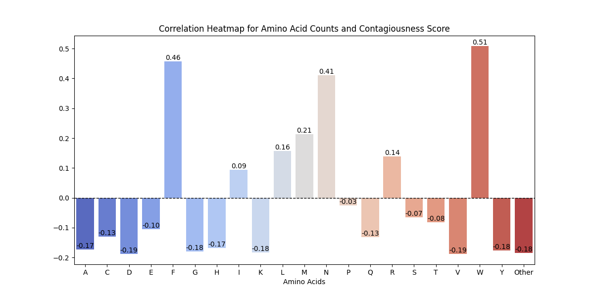
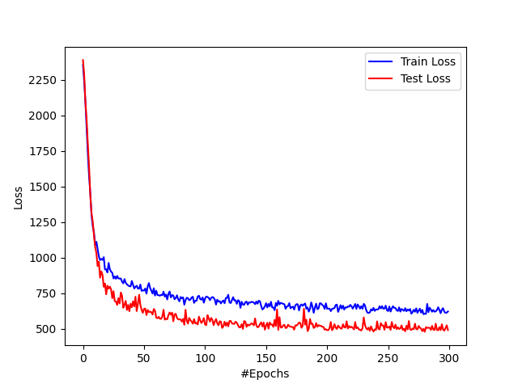

# *CONTAGIOUSNESS NN*
## Romell Padua & Thomas Knickerbocker
12/2023

### *Purpose:*
The purpose of this project is to investigate correlations between the contagiousness of a SARS-COV-2 sample (grouped according to pangolin) and the frequencies of each amino acid present within it. 

### *Directory Structure:*
.
├── README.md
├── REAEDME_Figures
│   ├── Vaccine_Model_Barplot.png
│   └── epoch_graph_vaccine_model.png
├── data
│   ├── all_sequences.csv
│   ├── codon_table.txt
│   ├── old_data
│   ├── processed_input_data_vacmodel.csv
│   ├── processed_input_data_vacmodel_info.txt
│   └── raw_input_data.fasta
├── data_prep
│   ├── dfCreator.py
│   ├── input_data_analysis.py
│   └── plot_codons.py
└── model
    ├── amino_nn.py
    ├── model_storage
    ├── nn_helpers.py
    ├── result_analysis.py
    └── run_model.py

7 directories, 15 files

### *Data Sourcing:*
Used NCBI sequencing data for SARS-COV-2 genomes, which can be found[HERE](https://www.ncbi.nlm.nih.gov/labs/virus/vssi/#/virus?SeqType_s=Nucleotide&VirusLineage_ss=Severe%20acute%20respiratory%20syndrome%20coronavirus%202,%20taxid:2697049&SourceDB_s=GenBank&HostLineage_ss=Homo%20sapiens%20(human),%20taxid:9606&BaselineSurveillance_s=include&Completeness_s=complete&Region_s=North%20America&CollectionDate_dr=2020-03-01T00:00:00.00Z%20TO%202023-12-19T23:59:59.00Z).
Filtered for complete nucleotide sequences collected from homo sapiens in North America.

### *Methodology:*
- Clean data match sequences on accession number with all_sequences.csv to get metadata such as Pangolin & Date Collected
- Formulate Contagiousness Scores
- Inspect details of dataframe prior to training (input_data_analysis.py)
- Train on balanced version of data (run_model.py)
    - Input: Counts for main 20 amino acids + other category for less common aminos
    - Output: Contagiousness Scores
- Test
- Plot results (result_analysis.txt)

### *Results:*
*Correlations between amino acids and contagiousness:*

*Training:*

*<ins>Mean Abs Error of Model0:<ins>* 14.45

The above figure shows the correlation between the input counts of each amino acid and the contagiousness score. According to our model, Tryptophan (W), Phenylalanine (F), and Asparagine (N) are the amino acids that have the highest positive correlation to a high contagiousness score. 
Thus, COVID genomes containing higher frequencies of these aminos are <ins>more likely</ins> to be very contagious.

### *Notes:*
- raw_input_data.fasta not pushed to github because too large. Instead, a subset has been pushed.
